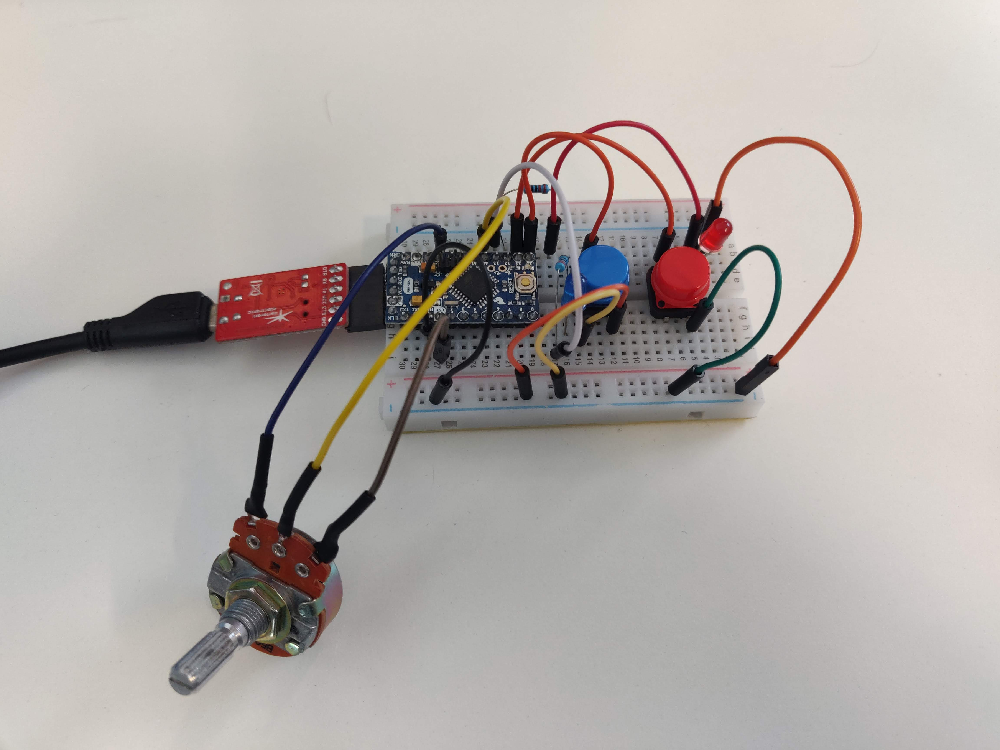

# HITLAB | Broomstick Controller  


  


## Object Classes  


### LED  
**Constructor:** 
```
led name(pin, OUTPUT);  
```

#### Methods  
- `void on();`  
- `void off();`  

#### Variable  
- `int pinAdr;`  


### Button  
**Constructor:**  
```
button name(pin, INPUT_PULLUP);  
```

#### Methods  
- `void invert();`    
- `void poll();`  
- `bool getState();`    

#### Variable  
- `int pinAdr;`  


### Potentiometer  
**Constructor:**  
```
pot name(pin, INPUT, ADC bits, device voltage);  
```

#### Method  
- `float getVoltage();`  

#### Variable  
- `int pinAdr;`  


## Variadic Functions  

### Active High <-> Active Low  
```
invertTrigger(number of addresses, &button1, &button2,...);  
```

### Update Button States  
```
pollInputs(number of addresses, &button1, &button2,...);  
```
### Convert States to a Number  
```
int state = statesToNumber(number of addresses, &button1, &button2,...);  
```
